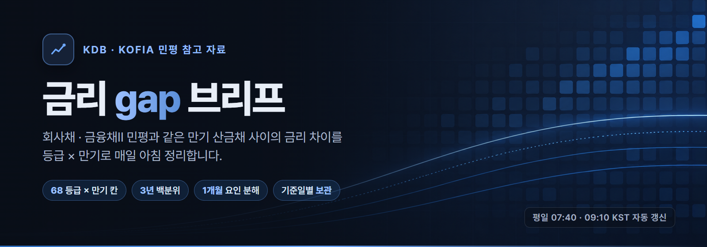
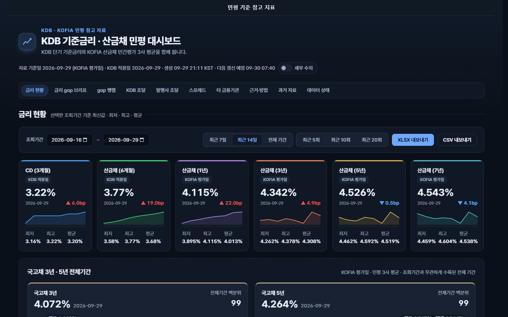
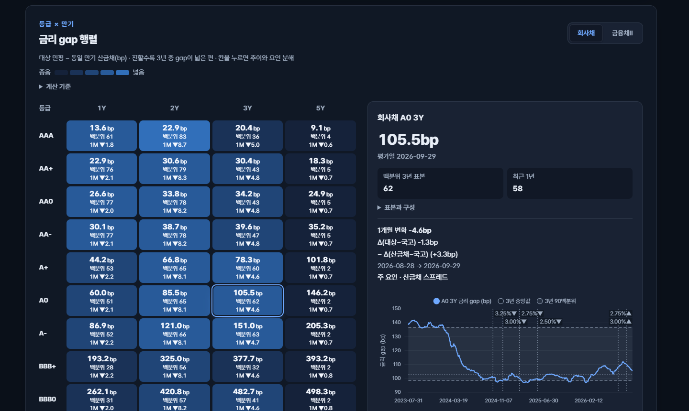

### 회사채·금융채Ⅱ와 산금채의 금리 차이를 한눈에

같은 만기의 민평 금리 차이를 등급 × 만기로 비교하고, 최근 3년 중 어느 수준인지 확인합니다.

   

KDB·KOFIA의 공식 서비스가 아닌 비공식 참고용 대시보드입니다.

## 처음 보신다면

1. [금리 현황](https://hanriverflow.github.io/rate-gap/#rates-overview)에서 조회기간을 골라 금리 수준과 변화를 확인합니다.
2. [금리 gap 브리프](https://hanriverflow.github.io/rate-gap/#rate-gap-brief-title)에서 회사채 3년·금융채Ⅱ 5년의 등급별 차이를 읽습니다.
3. [등급 × 만기 행렬](https://hanriverflow.github.io/rate-gap/#gap-matrix-title)의 칸을 눌러 추이·백분위·변화 요인을 확인합니다.

---

## 최신 게시 브리프 · 자료 기준일 2026-10-08

실시간 시세가 아니라 자료 기준일의 민평입니다. 지표별 평가일과 자료 경과일은 [대시보드](https://hanriverflow.github.io/rate-gap/)에서 확인하세요.

> 산금−국고 27.7bp(3년 백분위 88). 회사채 3Y 금리 gap은 1개월간 전 등급 동반 축소, 주 요인 산금채 스프레드(산금채 +3.4bp · 시장 평균 -0.2bp). 금융채Ⅱ 5Y 금리 gap은 등급별 1개월 변화 방향 혼재 또는 보합.

| 조달 수준 | 값 | 3년 백분위 | 최근 1년 백분위 |
| --- | ---: | ---: | ---: |
| 산금채 3Y | 4.274% | | |
| 국고채 3Y | 3.997% | | |
| **산금 − 국고** | **27.7bp** | 88 | 97 |

#### 회사채 3Y − 산금채 3Y

| 등급 | 금리 gap | 3년 백분위 | 최근 1년 | 1개월 변화 | 주 요인 |
| --- | ---: | ---: | ---: | ---: | --- |
| AA- | 38.9bp | 42 | 49 | -3.8bp | 산금채 스프레드 |
| A+ | 77.6bp | 56 | 51 | -3.5bp | 산금채 스프레드 |
| A0 | 104.8bp | 59 | 52 | -3.4bp | 산금채 스프레드 |
| A- | 150.3bp | 61 | 51 | -3.5bp | 산금채 스프레드 |

1개월(2026-09-08 → 2026-10-08): 전 등급 동반 축소 · 주 요인 산금채 스프레드 (산금채 +3.4bp · 시장 평균 -0.2bp)

#### 금융채Ⅱ 5Y − 산금채 5Y

| 등급 | 금리 gap | 3년 백분위 | 최근 1년 | 1개월 변화 | 주 요인 |
| --- | ---: | ---: | ---: | ---: | --- |
| AA- | 41.3bp | 8 | 23 | +0.3bp | 산금채 스프레드 |
| A+ | 154.0bp | 2 | 5 | -0.3bp | 시장 스프레드 |
| A0 | 220.1bp | 2 | 4 | -0.4bp | 시장 스프레드 |
| A- | 285.0bp | 2 | 5 | -0.4bp | 시장 스프레드 |

전체 68칸 등급 × 만기 행렬, 칸별 3년 추이와 요인 분해는 [대시보드](https://hanriverflow.github.io/rate-gap/#gap-matrix-title)에서 볼 수 있습니다.

## 화면

<table>
  <tr>
    <td width="50%"></td>
    <td width="50%"></td>
  </tr>
  <tr>
    <td align="center"><b>금리 현황</b> · 기간별 금리와 국고채 전체기간</td>
    <td align="center"><b>금리 gap 행렬</b> · 칸을 누르면 추이·백분위·요인 분해</td>
  </tr>
</table>

화면 예시입니다. 최신 수치는 대시보드와 위 브리프에서 확인하세요.

## 읽는 법과 계산 기준

- **금리 gap** = 대상 민평 − 같은 평가일 · 같은 만기 산금채 민평 (bp). 양수이면 대상 채권의 평가수익률이 더 높다는 뜻입니다.
- **단위 예시**: 1bp = 0.01%p. gap +50bp는 산금채보다 0.50%p 높다는 뜻이며, 3Y·5Y는 각각 만기 3년·5년입니다.
- **민평**: 거래 가격이 아닌 평가수익률입니다. 산금채 · 국고채는 3개 평가사, 회사채 · 금융채Ⅱ는 4개 평가사 평균으로, gap에는 평가사 구성 차이도 섞입니다.
- **백분위**: 최근 3년 표본 안에서 현재 gap의 위치입니다. 80이면 과거 표본 중 높은 편이라는 뜻입니다. 표본이 부족하면 산출하지 않습니다.
- **1개월 변화**: 30일 이전의 최신 공통 관측일과 비교하고, 변화를 시장 스프레드와 산금채 스프레드 요인으로 나눕니다.
- **날짜**: KDB는 적용일, KOFIA는 평가일 기준이며 서로 다른 날짜를 한 비교에 섞지 않습니다. 미국채 2·10년은 미국 동부 거래일(뉴욕 마감 = KST 익일 06:00·07:00) 기준의 참고 카드입니다.

## 갱신

- 평일 07:40 · 09:10 (KST)에 자동 갱신을 시도합니다. 핵심 원천 수집·검증을 통과한 결과만 게시하며, 실패하면 이전 결과를 유지합니다.
- 지난 기준일의 결과는 대시보드의 [과거 자료](https://hanriverflow.github.io/rate-gap/#archive)에서 다시 볼 수 있습니다.
- 대시보드 상단에 열람 시점 기준 자료 경과일이 표시됩니다.

## 출처와 이용 안내

[KDB산업은행 기업대출 기준금리](https://banking.kdb.co.kr/bp/CBADIE16N01.act) · [금융투자협회 채권정보센터](https://www.kofiabond.or.kr/).

- 민평 기준 참고 지표입니다. 실제 체결 금리나 개별 발행사의 확정 조달금리, 매매 신호를 뜻하지 않습니다.
- 원천 자료의 권리는 각 기관에 있습니다. 공개 열람과 출처 표시는 재사용 허가를 뜻하지 않으므로, 재배포·상업적 이용 전 원천의 이용 조건을 확인하세요.
- 자세한 산식과 해석상 한계는 대시보드의 [근거·방법](https://hanriverflow.github.io/rate-gap/#methodology)을 참고하세요.
